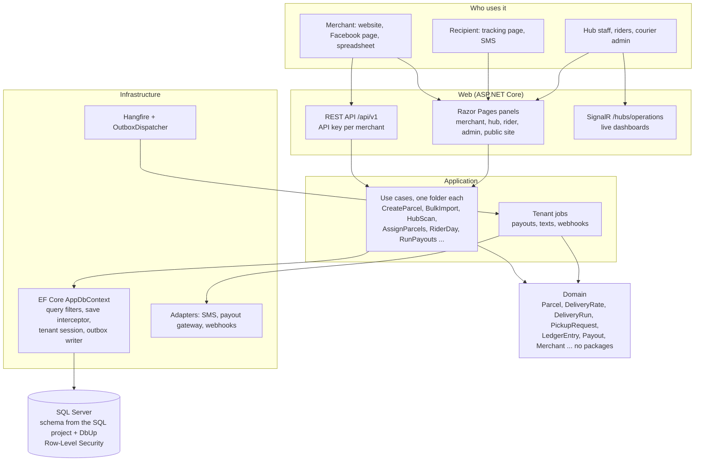
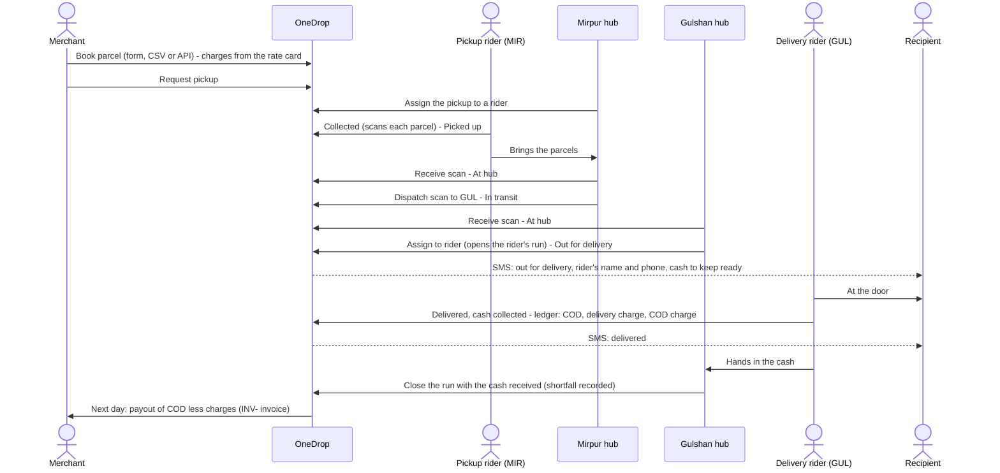
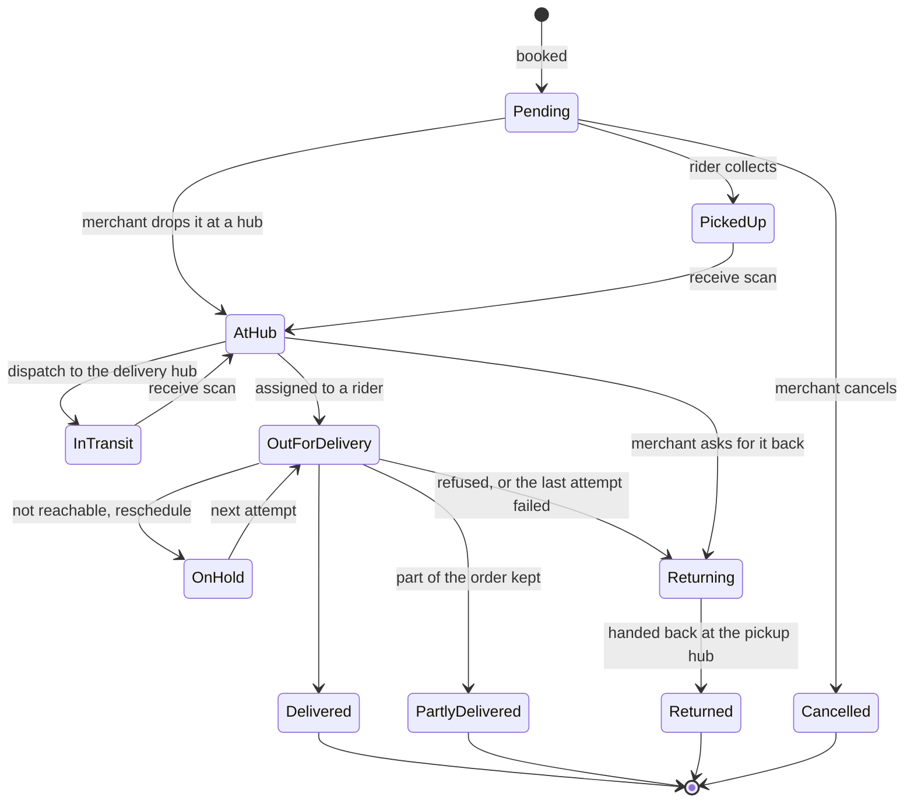
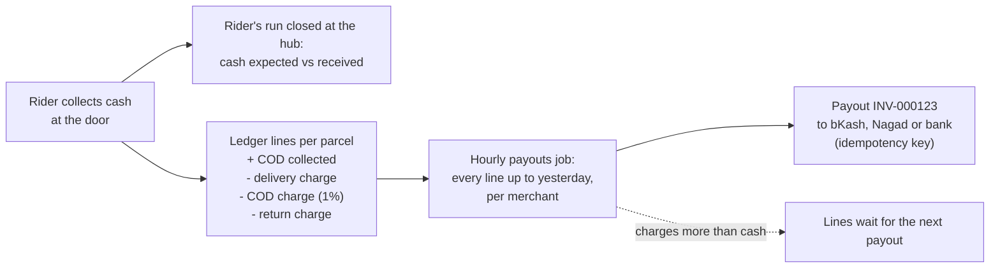
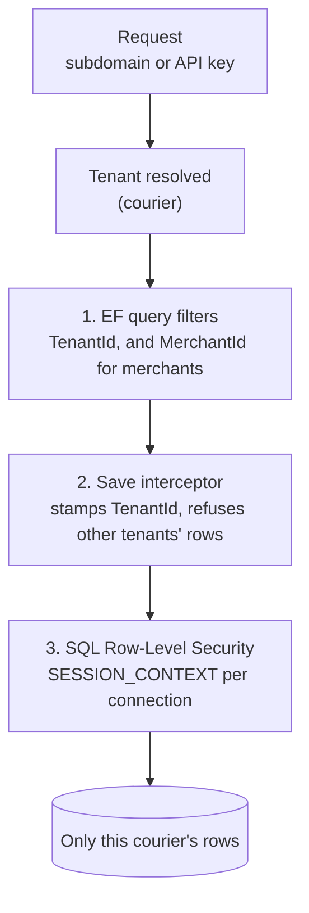
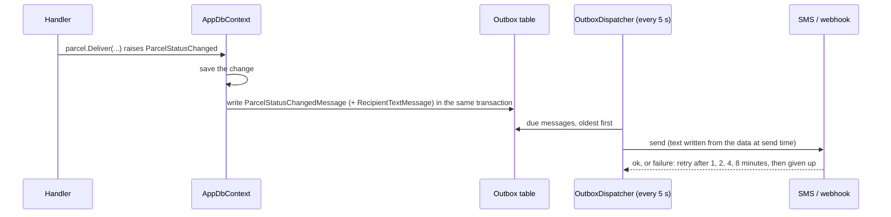

# How it fits together

Diagrams of the courier system as built. GitHub draws the Mermaid blocks; any Mermaid viewer works too. The words
behind them are in [Project-Context.md](Project-Context.md).

## 1. One application, four layers

A modular monolith in Clean Architecture: business rules know nothing of the database or the web, and the database
schema belongs to a SQL project, not to EF migrations.

| Project | Depends on | Holds |
|---|---|---|
| `src/Domain` | nothing | entities, the parcel state machine, the rate card and charges, runs and attempts, ledger and payouts |
| `src/Application` | Domain (+ EF Core for LINQ) | use cases, jobs, interfaces for the outside world |
| `src/Infrastructure` | Application | EF mapping, tenancy, Identity, fake SMS and payout gateways, webhooks, Hangfire, demo seeder |
| `src/Web` | Infrastructure | pages, API, SignalR, composition root |
| `src/Database`, `src/Database Update` | — | the schema (dacpac) and data migrations (DbUp) |

## 2. The life of one parcel

A parcel booked in Mirpur for a recipient in Gulshan: picked up by a Mirpur rider, sent to the Gulshan hub, delivered
there, and the merchant paid the next day.

## 3. Parcel states

Where a parcel is lives beside its status: `CurrentHubId` (on a hub's shelf), `TransferToHubId` (on the way between
hubs) or `RiderId` (with a rider); at most one is set, which the database checks. A hold is allowed while attempts
remain (the courier's `MaxDeliveryAttempts`, 3); the last failed attempt sends it back. A returning parcel travels
back through the hubs to its pickup hub and is handed back there.

## 4. Money

Charges are fixed when a parcel is booked (`DeliveryCharge`, `CodChargePercent`, `ReturnCharge` snapshot from the
rate card), so changing the rate card never reprices a parcel already booked.

## 5. Keeping couriers and merchants apart

Inside a courier, a merchant sees only its own parcels (query filter) and a rider only the parcels given to them
(each rider query filters by the signed-in rider). The fraud check is the one place that counts a phone's parcels at
every merchant, and it returns counts only, never a merchant's name. The isolation sweep test lists every route the app
maps and fails for a new one without a line saying what another courier, merchant or rider gets there.

## 6. The outbox

A text that is out of date when its turn comes (an "out for delivery" text for a parcel already delivered) is not
sent. Given-up messages are listed for the admin on **Failed messages** and can be sent again.

## 7. A day at the courier

| When | Who | What |
|---|---|---|
| Morning | Merchants | Book the day's parcels, request pickups |
| Late morning | Hub staff | Assign pickups to riders; riders collect and scan |
| Afternoon | Hub staff | Receive scans; dispatch parcels for other hubs (in transit) |
| Afternoon | Hub staff | Assign parcels to riders by area: each rider's run for the day opens |
| Evening | Riders | Deliver: delivered, partly delivered, on hold (with a date), refused |
| End of run | Hub staff | Close each run: cash received against expected; held and refused parcels back on the shelf |
| Every hour | Payouts job | Pays each merchant every ledger line up to yesterday (courier's time zone) |
