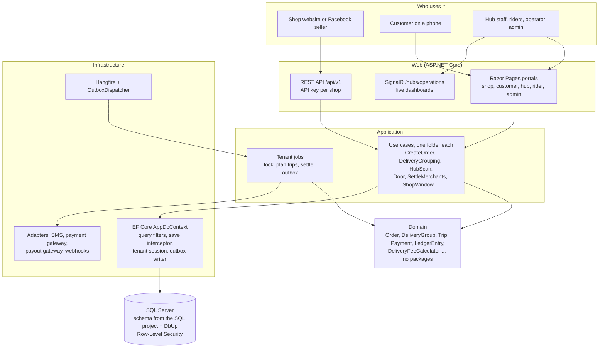
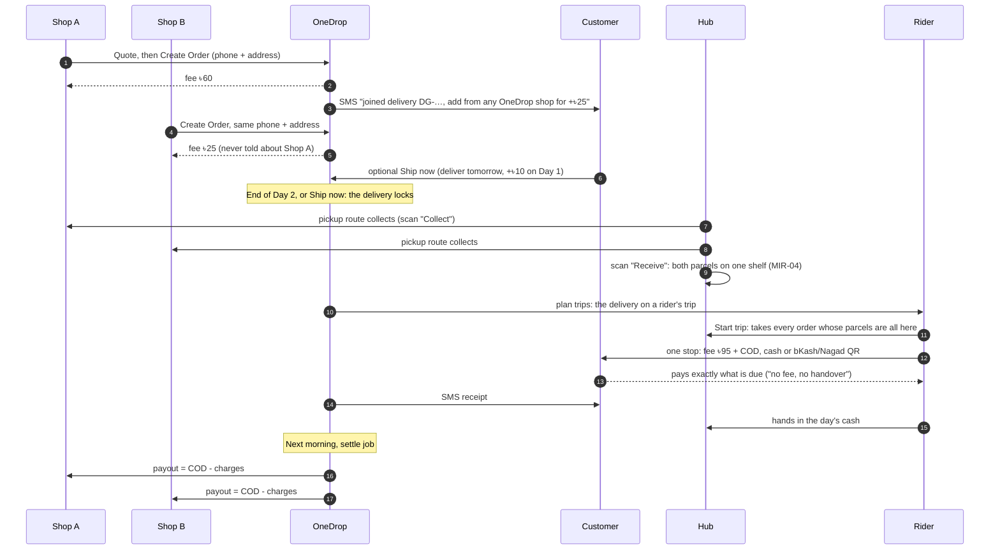
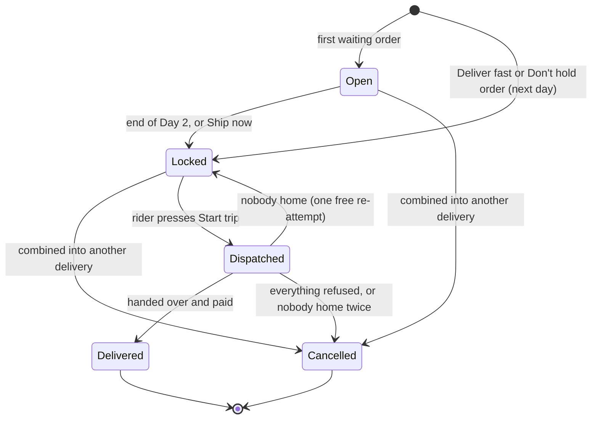
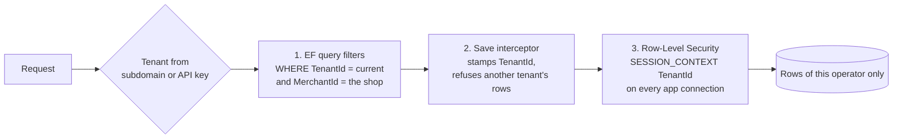
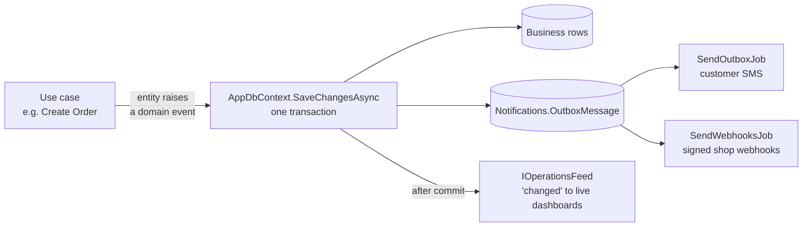

# How it fits together

Diagrams of the system as built at the end of the 4-week MVP. GitHub draws the Mermaid blocks; any Mermaid viewer
works too. The words behind them are in [Project-Context.md](Project-Context.md).

## 1. One application, four layers

A modular monolith in Clean Architecture: business rules know nothing of the database or the web, and the database
schema belongs to a SQL project, not to EF migrations.

| Project | Depends on | Holds |
|---|---|---|
| `src/Domain` | nothing | entities, state machines, fee calculator, trust and drop-off rules |
| `src/Application` | Domain (+ EF Core for LINQ) | use cases, jobs, interfaces for the outside world |
| `src/Infrastructure` | Application | EF mapping, tenancy, Identity, fake SMS/payment/payout gateways, webhooks, Hangfire |
| `src/Web` | Infrastructure | pages, API, SignalR, composition root |
| `src/Database`, `src/Database Update` | — | the schema (dacpac) and data migrations (DbUp) |

The project references allow only these directions, so a business rule cannot reach the database or the web.
`tests/Architecture.Tests` fails when an entity outside `Platform` has no `TenantId`, or a SQL file is missing from the
SQL project or its standard header.

## 2. The life of one delivery

Two shops, one customer, one rider, one fee. The money at the door is the delivery fee (OneDrop's) and the cash on
delivery (the shops'); the shops are paid their COD the next day.

## 3. Delivery states

A delivery group opens with the customer's first order to an address and is the unit the hub shelves and the rider
delivers. Orders have their own states (`Created` → `PickedUp` → `AtHub` → `OutForDelivery` → `Delivered`, or
`Refused` → `ReturnedToMerchant`, or `Cancelled`).

`Kind` tells what a locked delivery may still take: `Waiting` (the 3-day kind) takes nothing once locked;
`NextDay`, `ShippedNow` and `FollowUp` still take the customer's orders while the new order's pickup route reaches the
hub before the delivery's trip.

## 4. Keeping operators apart

Three layers, so a bug in one is still caught by the next. Inside an operator a fourth rule hides each shop's orders
from every other shop.

| Check | Where |
|---|---|
| Every route answers another operator or shop with nothing of this one's | `tests/Integration.Tests/TripTests.Isolation.cs` (a new route fails until it has its line) |
| Every tenant table is in the security policy | `RowLevelSecurityTests` |
| Every entity outside `Platform` carries a `TenantId` | `Architecture.Tests` |

## 5. Side effects through the outbox

Texts and webhooks never run inside the use case. The change and its message are saved in one transaction, then sent
by a loop every 5 seconds, retried after 1, 2, 4 and 8 minutes.

## 6. A day at an operator

Times are the tenant's own (Dhaka shown).

| Time | What | How |
|---|---|---|
| All day | Orders arrive and join deliveries | API or the shop's New order page |
| Every 5 s | Customer texts, shop webhooks | outbox loops |
| Every 5 min | Deliveries past their deadline lock | `lock-due-groups` job |
| 11:00–13:30 | Pickup routes, farthest zones first | route sheet per zone |
| About 14:30 | Hub shuttle to the customer's hub | shuttle manifest, load and receive scans |
| From midnight, every 15 min | Deliveries due today go onto riders' trips | `plan-trips` job, or **Plan trips now** |
| 17:00–21:00 | Riders deliver, one stop per customer and area | rider's **Today** |
| Evening | Riders hand in cash | hub **Cash** |
| Every hour | Shops paid everything up to yesterday | `settle-merchants` job |
